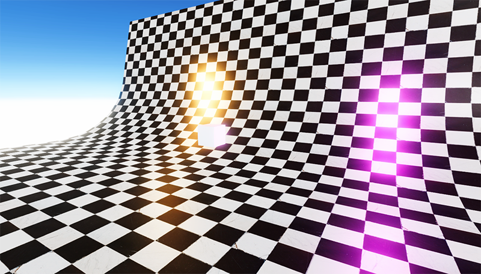

# VR20-demo-01

 
## Description

Unity demo. A setup tests for post-processing, VFX effects, shaders.

## Authors / Credits

Fredrik Persson

## Installation

Download the project with github and
open it up in Unity Hub.

## Usage

Learn more in the official documentation

## Changes

More information could be found in the CHANGELOG file.

## Contributing

Bug reports and pull requests are welcome on Github https://github.com/frpe1/VR20-demo-01

## Stay in touch

Website
Twitter
Facebook
Discord
